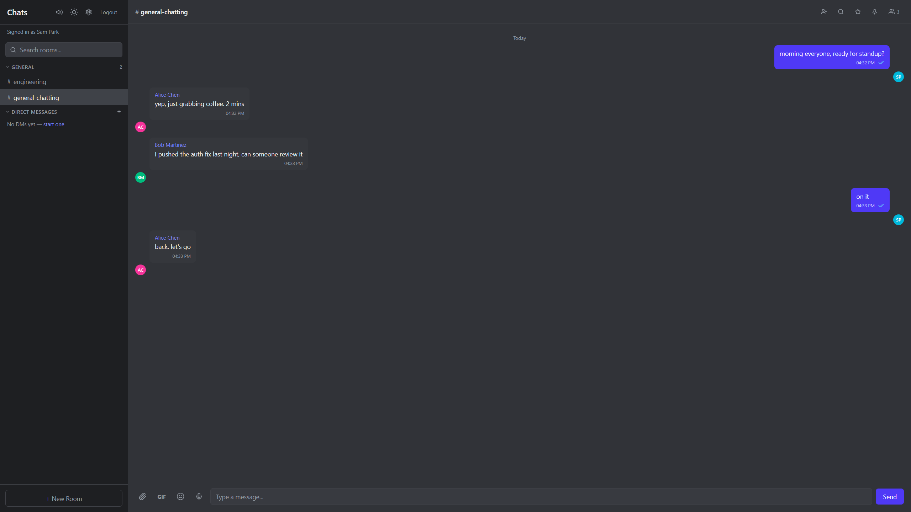
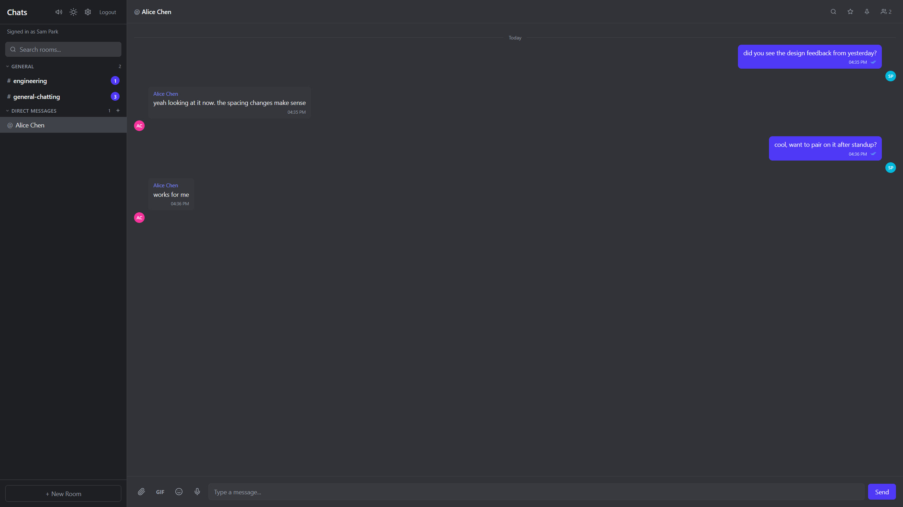
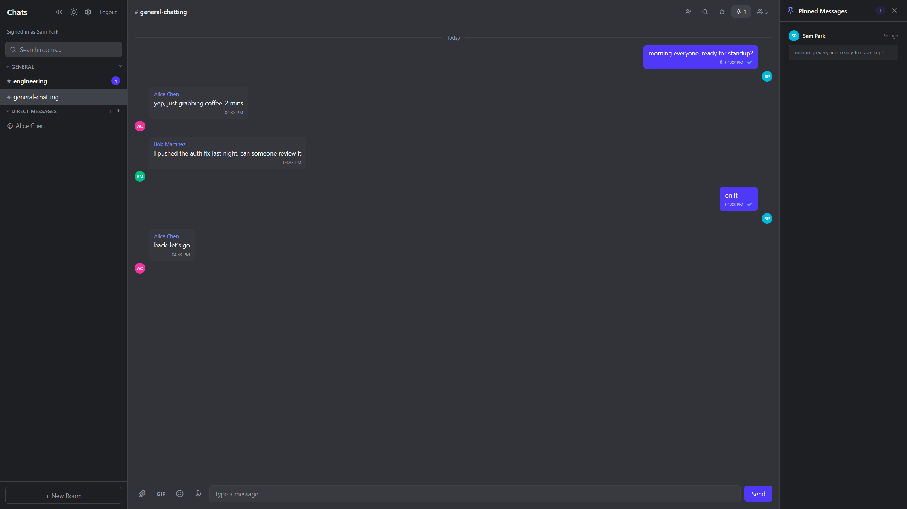
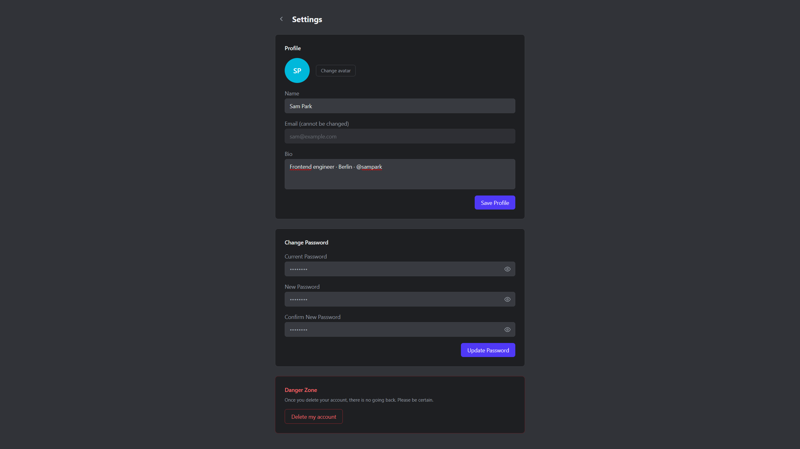

# PulseChat

A real-time chat application built to explore production-grade authentication, WebSocket authorization, and multi-instance broadcast patterns.

🔗 **[Live demo](https://pulsechat-plum.vercel.app)** · Backend on Railway · Frontend on Vercel · Storage on Cloudflare R2

---

## Screenshots

| Channel view | Direct message |
|:---:|:---:|
|  |  |

| Pinned messages | Settings |
|:---:|:---:|
|  |  |

---

## Why this project

The goal was to take a familiar problem — group chat — and use it as a forcing function for the parts of backend engineering that are hard to learn from tutorials: refresh-token rotation with reuse detection, anti-enumeration login timing, per-event WebSocket authorization, and the cache + pub/sub work needed to broadcast across multiple API replicas. The codebase has gone through 22 merged PRs of focused security and integrity hardening, each one reviewed and shipped with unit and end-to-end coverage. The result is a working app, but the artifact worth showing is the test suite and the commit history — every fix is traceable to the bug it closed.

## Notable engineering decisions

1. **Refresh token rotation with reuse detection.** Refresh tokens are SHA-256 hashed at rest. Each successful refresh rotates the stored hash. A second refresh arriving with the now-stale hash is treated as a reuse attack: every active refresh row for that user is deleted, forcing a fresh login on every device. Implemented in `apps/api/src/auth/auth.service.ts`. The frontend pairs this with a single-flight refresh promise (`apps/web/app/lib/api-client.ts`) so concurrent 401s share one round-trip and don't trigger false reuse detection.

2. **Anti-enumeration login timing.** A login attempt with an unknown email runs `bcrypt.compare` against a static dummy hash so response time doesn't reveal whether the account exists. The same generic 401 ("Invalid credentials") is returned in either case. Registration follows the same pattern — name and email collisions both surface as a generic conflict message, never field-specific.

3. **Per-event WebSocket authorization.** Every Socket.io event handler calls `assertMember(userId, roomId)` against the database before broadcasting or writing. Non-members can't subscribe to a channel by emitting `join_room` with a guessed id, can't write read receipts into rooms they aren't in, and can't fire typing indicators across room boundaries. `mark_read` additionally verifies the message's actual roomId matches the one supplied by the client. See `apps/api/src/chat/chat.gateway.ts`.

4. **Rate limiting at both layers, distinct strategies.** HTTP routes use NestJS Throttler with per-route overrides (auth endpoints stricter than upload, upload stricter than the global default). WebSocket events use per-user Redis counters (`send_message`, `edit_message`, `toggle_reaction`, `mark_read`, `typing_start`, `join_room`) since the throttler guard doesn't reach socket events. Counters are sliding-window with explicit TTL on first hit.

5. **Multi-instance broadcast via Redis pub/sub adapter.** `@socket.io/redis-adapter` is wired in `apps/api/src/main.ts` before any gateway boots. Each replica owns dedicated `pubClient` and `subClient` ioredis connections (subscribed clients can't issue regular commands, so they must be separate). Without this, `server.to(roomId).emit(...)` only reaches sockets on the same Node process — fine with one replica, broken the moment Railway scales out.

## Architecture

```
┌──────────────┐     WebSocket      ┌──────────────┐
│   Next.js    │◄──────────────────►│   NestJS     │
│   Frontend   │     Socket.io      │   Backend    │
│  (port 3000) │                    │  (port 3001) │
└──────────────┘                    └──────┬───────┘
                                           │
                                    ┌──────┴───────┐
                                    │              │
                              ┌─────┴────┐  ┌─────┴────┐
                              │PostgreSQL│  │  Redis   │
                              │  (5432)  │  │  (6379)  │
                              └──────────┘  └──────────┘
```

```
pulsechat/
├── apps/
│   ├── api/                  # NestJS Backend
│   │   ├── src/
│   │   │   ├── auth/         # JWT auth (access + refresh tokens)
│   │   │   ├── chat/         # WebSocket gateway (Socket.io)
│   │   │   ├── messages/     # Message CRUD, replies, reactions
│   │   │   ├── rooms/        # Channels, DMs, invites
│   │   │   ├── users/        # User profiles
│   │   │   ├── pins-stars/   # Pin & star messages
│   │   │   ├── upload/       # File attachments (Multer)
│   │   │   └── prisma/       # Database service
│   │   └── prisma/           # Schema & migrations
│   └── web/                  # Next.js Frontend
│       └── app/
│           └── chat/         # Chat UI, rooms, modals
├── docker-compose.yml        # PostgreSQL + Redis + API + Web
└── package.json
```

## Tech stack

| Layer | Technology |
|---|---|
| Frontend | Next.js 16, React 19, Tailwind CSS 4, Socket.io client |
| Backend | NestJS 11, Socket.io 4.8, Passport JWT |
| Database | PostgreSQL 16, Prisma ORM |
| Cache & pub/sub | Redis 7 (`@socket.io/redis-adapter`) |
| Storage | Cloudflare R2 (S3-compatible, via `@aws-sdk/client-s3`) |
| Auth | JWT access + refresh tokens (rotation), bcrypt, anti-enumeration timing |
| Validation | class-validator + class-transformer (nested DTOs) |
| Sanitization | isomorphic-dompurify (server + client), file-type magic-byte checks |
| Email | Nodemailer (SMTP, with kill-switch for missing config) |
| Rate limiting | NestJS Throttler (HTTP), Redis counters (WebSocket) |
| Testing | Jest (unit + e2e), supertest, in-memory Prisma mocks |
| Deploy | Docker Compose, Railway (API + Postgres + Redis), Vercel (frontend) |

## Codebase

- 88 commits across 22 merged PRs, every change reviewed and tested before merge
- 55 end-to-end tests covering authorization paths, validation rules, and refresh token rotation
- 89 unit tests on services, with in-memory Prisma mocks for deterministic auth scenarios
- Run with `npm run test` and `npm run test:e2e` from `apps/api/`

## Database schema

```
User ──< RoomMember >── Room
  │                       │
  │── Message ────────────│
  │── MessageReaction     │── RoomInvite
  │── Mention             │── Pin
  │── Star                │── ReadReceipt
```

**10 models:** User, Room, RoomMember, RoomInvite, Message, MessageReaction, Mention, Pin, Star, ReadReceipt

## Local development

### Quick Start (Docker)

```bash
git clone https://github.com/MuratZrl/pulsechat.git
cd pulsechat
docker compose up
```

- Frontend: http://localhost:3000
- API: http://localhost:3001

### Manual Setup

```bash
# Install dependencies
npm install
cd apps/api && npm install
cd ../web && npm install

# Start PostgreSQL + Redis
docker compose up postgres redis -d

# Run database migrations
cd apps/api
npx prisma db push

# Start API
npm run start:dev

# Start frontend (new terminal)
cd apps/web
npm run dev
```

## API reference

### Auth
| Method | Endpoint | Description |
|--------|----------|-------------|
| POST | `/api/auth/register` | Create account |
| POST | `/api/auth/login` | Sign in (returns JWT) |
| POST | `/api/auth/refresh` | Refresh access token |

### Rooms
| Method | Endpoint | Description |
|--------|----------|-------------|
| POST | `/api/rooms` | Create channel |
| GET | `/api/rooms` | List user's rooms |
| POST | `/api/rooms/:id/join` | Join room |
| POST | `/api/rooms/:id/leave` | Leave room |
| POST | `/api/rooms/:id/invite` | Create invite link |
| POST | `/api/rooms/invite/:code/join` | Join via invite code |
| GET | `/api/rooms/dm/:userId` | Get/create DM |

### Messages
| Method | Endpoint | Description |
|--------|----------|-------------|
| GET | `/api/rooms/:roomId/messages` | Get messages (paginated) |
| POST | `/api/rooms/:roomId/messages` | Send message |
| PATCH | `/api/messages/:id` | Edit message |
| DELETE | `/api/messages/:id` | Delete message |
| POST | `/api/messages/:id/reactions` | Toggle reaction (HTTP fallback for `toggle_reaction`) |

### WebSocket Events
| Event | Direction | Description |
|-------|-----------|-------------|
| `send_message` | Client → Server | Send new message |
| `new_message` | Server → Client | Receive message |
| `typing_start` | Client → Server | Start typing |
| `typing_stop` | Client → Server | Stop typing |
| `user_typing` | Server → Client | User is typing |
| `message_edited` | Server → Client | Message was edited |
| `message_deleted` | Server → Client | Message was deleted |
| `reaction_updated` | Server → Client | Reaction changed |
| `read_receipt` | Bidirectional | Mark messages read |

## License

MIT
